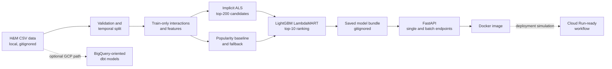

# ShopSignal — Two-Stage Recommendation & Personalisation Platform

ShopSignal is an end-to-end retail recommendation system built to demonstrate the
modelling and production-engineering decisions behind a modern e-commerce recommender.
It converts implicit purchase behaviour into top-10 product recommendations with an
ALS candidate generator, a LightGBM LambdaMART re-ranker, and a popularity fallback
for customers without training history.

The system was evaluated locally on **15 million H&M transactions**. On the untouched
test period, re-ranking improved **NDCG@10 by approximately 6%** and **Recall@10 by
approximately 12%** over raw ALS. The repository includes tested FastAPI serving,
model-bundle persistence, Docker packaging, BigQuery/dbt-oriented data models, and
GitHub Actions quality gates. Cloud Run deployment is prepared but intentionally
**simulated, not live**, because GCP credentials and cost approval have not been supplied.

## Business problem

Large retail catalogues make it difficult to retrieve and order relevant products for
each customer quickly. ShopSignal separates that problem into two stages:

1. **Retrieve broadly:** implicit ALS generates 200 personalised candidates efficiently.
2. **Rank precisely:** LightGBM LambdaMART combines ALS scores with train-only user and
   item features to return the best 10 products.

A training-set popularity model provides both a transparent baseline and a deterministic
fallback for cold-start users.

## Architecture



Solid lines show locally implemented and tested execution. Dashed lines show prepared
GCP integration: the dbt SQL is implemented, while BigQuery materialisation, Artifact
Registry publishing, and Cloud Run deployment have not been activated.

## Verified modelling evidence

### Data and configuration

| Item | Verified value |
|---|---:|
| Transactions | 15,000,000 |
| Date range | 2019-09-19 to 2020-09-22 |
| Train / validation / test rows | 11,613,037 / 1,821,718 / 1,565,245 |
| ALS matrix | 899,083 users × 62,078 items |
| ALS configuration | 64 factors, 40 iterations, regularisation 0.01, alpha 40 |
| Ranker | LightGBM `LGBMRanker`, LambdaMART objective |
| Candidate/ranking depth | 200 candidates → top 10 |
| Full ranker evaluation | ~1 h 56 min, ~6.3 GB peak RAM |

`OPENBLAS_NUM_THREADS=1` was used for the validated ALS configuration. `implicit`
manages parallel work itself; allowing OpenBLAS to create another thread pool caused
CPU oversubscription and roughly a threefold slowdown in the observed tuning runs.

### Candidate generation

| Metric | Validation | Test |
|---|---:|---:|
| Recall@200 | 0.0843 | 0.0578 |
| Hit-rate@200 | 0.2590 | 0.1842 |

On the 10,000-user tuning sample, ALS Recall@200 was approximately **43% higher** than
the popularity candidate baseline.

### Top-10 ranking

| Method | NDCG@10 | Recall@10 | MAP@10 |
|---|---:|---:|---:|
| Popularity | 0.0065 | 0.0085 | 0.0031 |
| Raw ALS | 0.0089 | 0.0110 | **0.0047** |
| ALS + LightGBM | **0.0094** | **0.0124** | 0.0046 |

These are test-period results. The two-stage model improved test NDCG@10 by about 6%
and Recall@10 by about 12% over raw ALS. Test MAP@10 was effectively at parity and
marginally lower; no MAP improvement is claimed. Validation NDCG@10 improved by about
33% over raw ALS. Detailed evidence is in
[`docs/als_tuning_results.md`](docs/als_tuning_results.md) and
[`docs/lightgbm_ranker_results.md`](docs/lightgbm_ranker_results.md).

## Evaluation and leakage controls

The split is chronological: training ends on 2020-06-30, validation covers
2020-07-01–2020-08-11, and test covers 2020-08-12–2020-09-22. This mirrors deployment,
where only past behaviour is available when future purchases occur.

- ALS and popularity are fitted on training interactions only.
- User/item aggregates and ranking features are computed from training rows only.
- Validation is used for model selection and early stopping.
- Test is held back for the final comparison and is not used for tuning.
- Seen training items are excluded from ALS candidates.
- Cold-start users are reported separately and excluded from known-user offline metrics.
- Cold-start items remain in ground truth, exposing the model's catalogue-coverage limit.

Test metrics are lower than validation primarily because catalogue cold start rises from
11.4% of validation items to 26.4% of test items, and the test window is farther from the
training cutoff. ALS cannot learn latent factors for products that did not exist in its
training interactions.

## Serving

| Method | Endpoint | Purpose |
|---|---|---|
| `GET` | `/health` | Liveness and Docker health probe |
| `GET` | `/version` | App version and loaded-model metadata |
| `POST` | `/recommend` | Top-N recommendations for one customer |
| `POST` | `/recommend/batch` | Top-N recommendations for up to 1,000 customers |
| `GET` | `/docs` | Generated OpenAPI/Swagger UI |

When `SHOPSIGNAL_MODEL_DIR` points to a complete saved bundle, known users follow
ALS → LightGBM and unknown users receive popularity recommendations. Without the bundle,
the API deliberately returns deterministic mock data so its contract, tests, and Docker
health check remain runnable from a fresh clone. Responses identify the path with the
`source` field (`als+lgbm`, `popularity`, or `mock`).

## CI/CD lifecycle and deployment status

GitHub Actions implements:

- pull-request repository checks, Ruff lint/format checks, unit tests, API smoke tests,
  Docker build, and container health verification;
- post-merge quality checks and a SHA-tagged release-candidate build;
- build metadata retention for traceability;
- manual staging/production workflow structure and rollback commands;
- a manual retraining/promotion workflow scaffold.

Important boundaries:

- Release-candidate images are built and health-checked inside Actions but are **not
  pushed** to Artifact Registry.
- Deployment jobs are explicit simulations; authentication and `deploy-cloudrun` steps
  are commented until GCP setup and cost approval exist.
- The retraining workflow uses placeholder validation/training/evaluation outputs and is
  not scheduled. Real local training and evaluation code exists separately.
- No live service URL, production traffic, online A/B result, or commercial uplift is
  claimed.

See [`docs/ci-cd-guide.md`](docs/ci-cd-guide.md) for the exact automation boundary.

## Local setup

Prerequisites: Python 3.11 and, for container validation, Docker.

```bash
git clone https://github.com/ozzy2438/ShopSignal-GCP-Native-Recommendation-Personalisation-Platform.git
cd ShopSignal-GCP-Native-Recommendation-Personalisation-Platform

python3.11 -m venv .venv
source .venv/bin/activate
python -m pip install --upgrade pip
python -m pip install -r requirements.txt
cp .env.example .env
```

Download the H&M files only when running data/model workflows; see
[`docs/data.md`](docs/data.md). The API and automated tests do not require the dataset.

### Quality and tests

```bash
ruff check src tests pipelines
ruff format --check src tests pipelines
pytest tests/ -v

# Repository shortcuts
make lint
make format-check
make test
```

The repository's validated serving integration brought the suite to **142 passing
tests** across unit, integration, and smoke coverage.

### Run the API

```bash
uvicorn src.serve.app:app --host 0.0.0.0 --port 8080
curl http://localhost:8080/health
```

To load real artifacts:

```bash
export SHOPSIGNAL_MODEL_DIR=/absolute/path/to/model-bundle
uvicorn src.serve.app:app --host 0.0.0.0 --port 8080
```

### Docker

```bash
docker build -t shopsignal-api:local .
docker run --rm -p 8080:8080 -e APP_ENV=local shopsignal-api:local
curl http://localhost:8080/health
```

## Data and artifact policy

Raw H&M CSV files and trained model bundles are intentionally excluded from Git because
of dataset licensing/size and artifact size. `data/` and serialized files under `models/`
are gitignored. The repository contains code, configuration examples, SQL models, tests,
and measured evaluation reports—not redistributed source data or large fitted models.

## Limitations and next steps

- Results are offline metrics on public historical retail data, not online business KPIs.
- ALS cannot retrieve newly introduced items without interactions; a content-based
  candidate path is the main modelling opportunity.
- Ranking evaluation is bounded by ALS candidate recall.
- The pandas training path was validated locally; BigQuery/dbt execution has not been
  connected to the evidence run.
- Batch precomputation, monitoring, a real model registry, scheduled retraining, and live
  Cloud Run deployment remain optional future work requiring cloud configuration.

## Repository structure

```text
.
├── .github/workflows/     # PR gates, release-candidate build, deployment simulation
├── dbt/models/            # BigQuery-oriented staging and feature marts
├── docs/                  # Architecture, data, evidence, CI/CD, application material
├── pipelines/retrain.py   # Placeholder retraining-orchestration scaffold
├── scripts/train_ranker.py # Local two-stage evidence run
├── src/data/              # Local loading, validation, temporal splitting
├── src/features/          # Train-only feature and ranking-dataset construction
├── src/models/            # Popularity, ALS, LightGBM, two-stage composition
├── src/evaluate/          # Recall, hit-rate, NDCG, and MAP evaluation
├── src/serve/             # FastAPI, schemas, and lazy model registry
├── tests/                 # Unit, integration, and smoke tests
└── Dockerfile             # Multi-stage, non-root API image
```

Further reading:

- [`docs/architecture.md`](docs/architecture.md) — component boundaries and data flow
- [`docs/data.md`](docs/data.md) — dataset, split, leakage, and reproducibility
- [`docs/ci-cd-guide.md`](docs/ci-cd-guide.md) — implemented automation vs simulation
- [`docs/kogan-application-pack.md`](docs/kogan-application-pack.md) — verified CV and interview material
- [`ShopSignal_Roadmap.md`](ShopSignal_Roadmap.md) — completed scope and honest next steps
