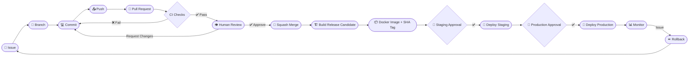

# ShopSignal — GCP-Native Recommendation & Personalisation Platform

> **Author:** Osman Orka &nbsp;|&nbsp; **Target Role:** Machine Learning Engineer — Kogan.com  
> **Stack:** Python · BigQuery · dbt · ALS · LightGBM · FastAPI · Docker · Cloud Run · GitHub Actions

---

## Overview

ShopSignal is a production-grade, GCP-native two-stage recommendation platform:

| Stage | Component | Description |
|-------|-----------|-------------|
| 1 | ALS Candidate Gen | Implicit collaborative filtering — produces top-200 candidates |
| 2 | LightGBM Ranker | LambdaMART list-wise ranking — re-ranks to top-10 by NDCG |
| Batch | BigQuery Serving Table | Nightly pre-computed recommendations |
| Real-time | FastAPI → Cloud Run | Online scoring for fresh recommendations |

---

## Current Status

> ⚠️ **Phase 1 — Repository Foundation.** The ML models are not yet trained.  
> This repository demonstrates the full CI/CD skeleton and development workflow.  
> See [`ShopSignal_Roadmap.md`](ShopSignal_Roadmap.md) for the full build plan.

| Component | Status |
|-----------|--------|
| Repository structure | ✅ Complete |
| CI/CD workflows | ✅ GitHub Actions |
| FastAPI placeholder | ✅ `/health` · `/version` · `/recommend` (mock) |
| Unit tests | ✅ metrics + serve |
| Docker build | ✅ Multi-stage |
| dbt models | 📄 SQL placeholders (BigQuery not yet provisioned) |
| ALS model | 🔲 Planned — `feat/two-stage-model` |
| LightGBM ranker | 🔲 Planned — `feat/two-stage-model` |
| Cloud Run deployment | 🔲 Planned — after GCP approval |

---

## CI/CD Lifecycle



---

## Quick Start

```bash
# 1. Clone and set up
git clone https://github.com/ozzy2438/ShopSignal-GCP-Native-Recommendation-Personalisation-Platform.git
cd ShopSignal-GCP-Native-Recommendation-Personalisation-Platform

python -m venv .venv && source .venv/bin/activate
pip install -r requirements.txt

# 2. Configure environment
cp .env.example .env
# Edit .env — no real credentials needed for local dev

# 3. Run tests
make test

# 4. Start the API
uvicorn src.serve.app:app --reload --port 8080
# → http://localhost:8080/docs

# 5. Build Docker image
make docker-build
```

---

## Project Structure

```
shopsignal/
├── .github/
│   ├── workflows/          # CI/CD automation
│   ├── ISSUE_TEMPLATE/     # Standardised issue forms
│   ├── PULL_REQUEST_TEMPLATE.md
│   ├── CODEOWNERS
│   └── dependabot.yml
├── config/                 # Environment-specific config (no secrets)
├── data/raw/               # gitignored — H&M CSV files (local only)
├── dbt/                    # BigQuery transformation models
│   ├── models/staging/     # stg_transactions, stg_articles, stg_customers
│   └── models/marts/       # fct_user_features, fct_item_features
├── docs/                   # Architecture, CI/CD guide, branching strategy
├── pipelines/retrain.py    # MLOps retraining entry point
├── src/
│   ├── data/               # BigQuery upload utilities
│   ├── features/           # Feature engineering
│   ├── models/             # ALS + LightGBM placeholders
│   ├── evaluate/           # NDCG, Recall, MAP metrics
│   └── serve/              # FastAPI application
├── tests/
│   ├── unit/               # Fast, no-credential tests
│   ├── integration/        # BigQuery integration tests
│   └── smoke/              # API end-to-end smoke tests
├── Dockerfile              # Multi-stage build for Cloud Run
├── Makefile                # Developer shortcuts
├── pyproject.toml          # Ruff, pytest, coverage config
└── requirements.txt
```

---

## Documentation

| Document | Description |
|----------|-------------|
| [docs/architecture.md](docs/architecture.md) | System architecture and data flow |
| [docs/ci-cd-guide.md](docs/ci-cd-guide.md) | Step-by-step CI/CD lifecycle walkthrough |
| [docs/branching-strategy.md](docs/branching-strategy.md) | Trunk-based development rules |
| [docs/environments.md](docs/environments.md) | Dev / staging / production environments |
| [docs/release-and-rollback.md](docs/release-and-rollback.md) | Release process and rollback procedures |
| [docs/manual-github-settings.md](docs/manual-github-settings.md) | Required GitHub UI settings |
| [CONTRIBUTING.md](CONTRIBUTING.md) | How to contribute |
| [ShopSignal_Roadmap.md](ShopSignal_Roadmap.md) | Full 5-day build plan |

---

## API Endpoints

| Method | Path | Description |
|--------|------|-------------|
| `GET` | `/health` | Liveness probe |
| `GET` | `/version` | App version and model stage |
| `POST` | `/recommend` | Top-N recommendations (mock until model is trained) |
| `GET` | `/docs` | Interactive Swagger UI |

---

## License

MIT — see [LICENSE](LICENSE) (to be added).
