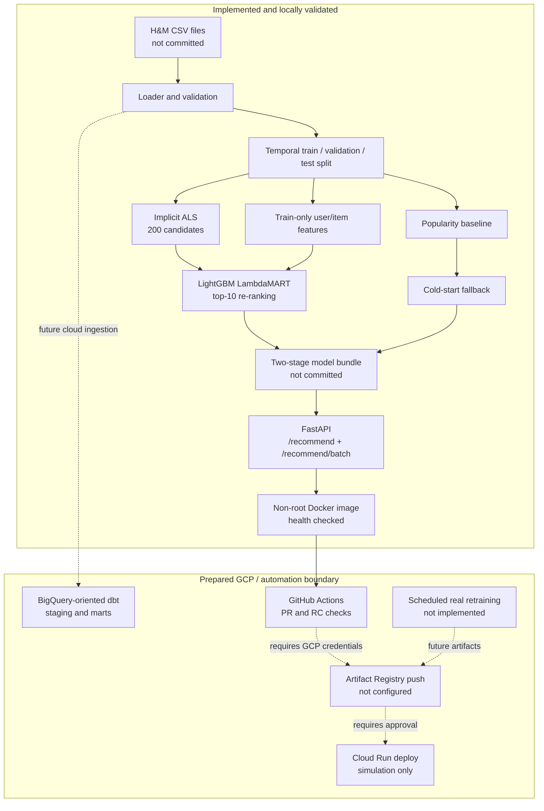

# System Architecture

ShopSignal separates verified local execution from cloud integration that is prepared but
not activated.

## Implemented components

### Data and validation

- Loads recent rows from local H&M transaction CSVs without committing source data.
- Checks required schemas, identifier/date validity, positive prices, and channel values.
- Uses deterministic chronological train/validation/test windows.
- Reports cold-start users and items rather than hiding them from diagnostics.

The local data path generated the modelling evidence. BigQuery upload is not part of that
validated execution; `src/data/upload_to_bq.py` remains a future integration interface.

### Candidate generation

- `PopularityRecommender` ranks training-set purchase counts and excludes seen items for
  known users. It is also the unknown-user fallback.
- `ALSCandidateGenerator` builds a confidence-weighted sparse matrix with
  `c_ui = 1 + alpha × purchase_count` and returns up to 200 unseen items.
- The validated ALS run used 64 factors, 40 iterations, regularisation 0.01, alpha 40,
  and `OPENBLAS_NUM_THREADS=1`.

### Ranking

- `LightGBMRanker` wraps `LGBMRanker` with the LambdaMART objective and NDCG@10
  evaluation.
- Ranking examples are grouped per user; positives come from the later label window.
- Feature tables are constructed from training interactions only.
- `TwoStageRecommender` composes ALS, ranking, fallback, and persistence.

### Serving and persistence

The bundle written by `TwoStageRecommender.save()` contains ALS, LightGBM, popularity,
cached feature tables, seen-item history, and schema/metadata files. The FastAPI registry
loads that bundle from `SHOPSIGNAL_MODEL_DIR`.

| Endpoint | Behaviour |
|---|---|
| `GET /health` | Liveness response used by Docker health checks |
| `GET /version` | Application version and model-load metadata |
| `POST /recommend` | ALS → LightGBM for known users; popularity for unknown users |
| `POST /recommend/batch` | Same path for up to 1,000 customer IDs |

When artifacts are absent, deterministic mock responses keep the API contract and image
testable. Mock mode demonstrates serving behaviour but is not a model result.

### Docker and GitHub Actions

- Multi-stage Python 3.11 image running as an unprivileged user.
- PR jobs run repository checks, Ruff, unit tests, smoke tests, a Docker build, and `/health`.
- Main-branch jobs rerun quality checks, build a SHA-tagged local release candidate, and
  retain build metadata.

## GCP-oriented components and status

### dbt/BigQuery

The repository contains SQL for transaction/article/customer staging views and user,
item, and user-item marts. These models express the intended BigQuery transformations,
but no claim is made that they were materialised or tested against a provisioned project.

### Cloud Run

The Docker contract is Cloud Run-compatible (`PORT` 8080 and `/health`). The deployment
workflow shows Workload Identity Federation and Cloud Run steps as commented reference
configuration. Current staging and production jobs print simulation summaries only.

No Artifact Registry image, Cloud Run revision, public endpoint, or live traffic is part
of the validated project state.

### Retraining

The workflow and `pipelines/retrain.py` demonstrate the intended validation → training →
evaluation → promotion structure, but currently return placeholder outputs. The schedule
is disabled. Real local modelling code is in `src/` and `scripts/train_ranker.py`; it is
not yet wired into cloud orchestration.

## Security properties

- Raw data, model artifacts, `.env`, and credentials are gitignored.
- The container runs as a non-root user.
- Workflow permissions are scoped per workflow.
- The proposed GCP path uses keyless Workload Identity Federation; credentials are not
  configured in this repository.

## Main technical limitation

Collaborative ALS has no representation for products introduced after training. Test
cold-start items reached 26.4%, depressing the candidate ceiling and final top-10 metrics.
A content-based retrieval path for new products is the clearest architectural extension.
